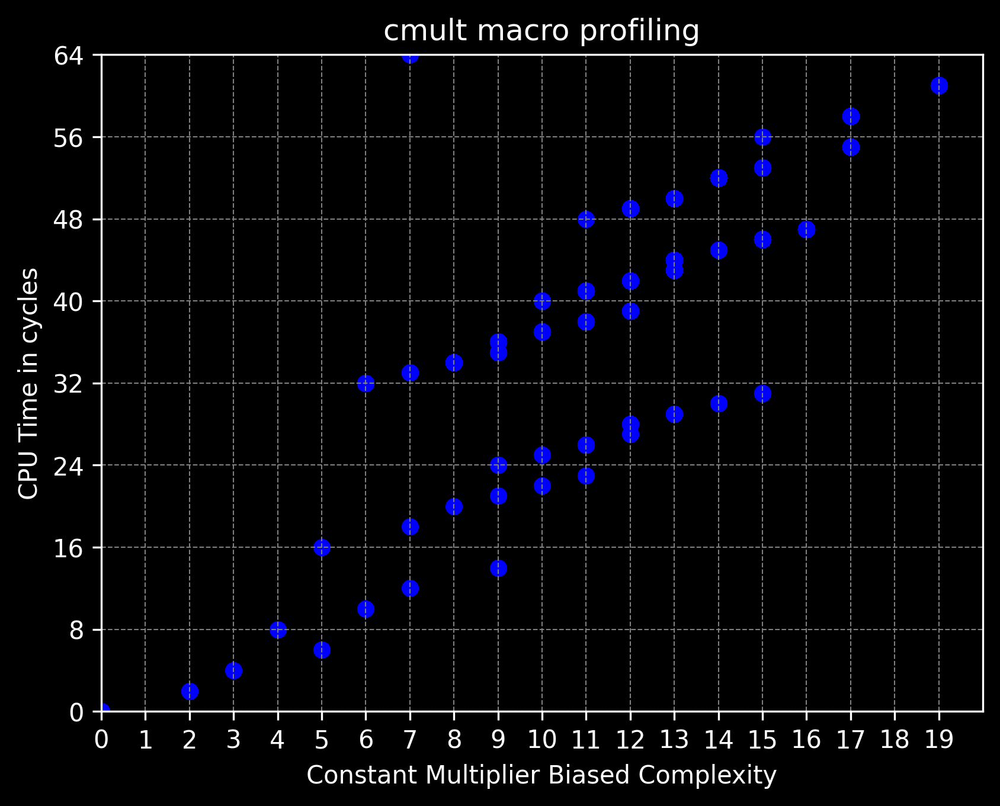

# `cmult`
---
###### Optimisation | `6502` | Any Hardware

`cmult` is a perfectly optimised macro for multiplying either the accumulator or a specified range of addresses by a constant within said limitation. `cmult` has two modes 'Accumulator' and 'Address', when in Accumulator mode `cmult` takes one required arguement `__multiplier__` and the secondary *optional* arguement `__temp__`.

`cmult` uses preprocessor logic to create the most optimal means of multiplying the contents of either the Accumulator or a RAM address by a constant value.`cmult` needs a 'temporary' as large as the output when completing the functionality. If you use the Address mode, you will also need to specify the Width of the output, the width of the input is deduced by the value of the constant.


```
cmult 6             ; multiply a by 6
cmult 6 $00         ; multiply a by 6, using $00 as temp
cmult 32 $00 out 2  ; multiply out by 32, using $00-$01 as temps
```
> Increasing the `__osize__` parameter beyond necessary will incur slowdown, having it below necessary could incur an overflow corruption. To see more about the affects of overflow corruption, visit `testing/results/cmult_accumulator_mode_oob.bmp` for a 3D graph demonstrating relative positional innaccuracy.


